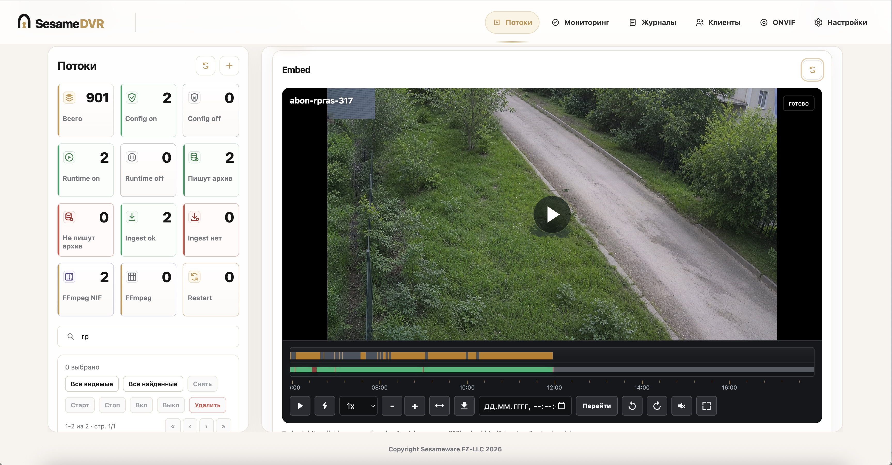
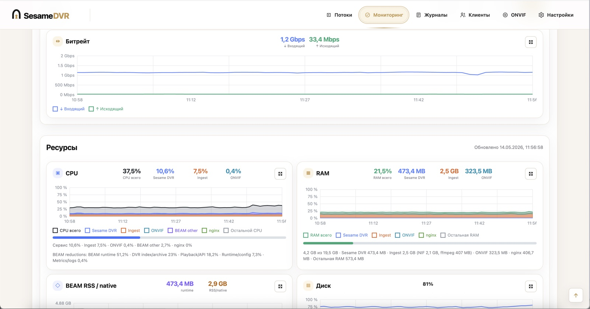
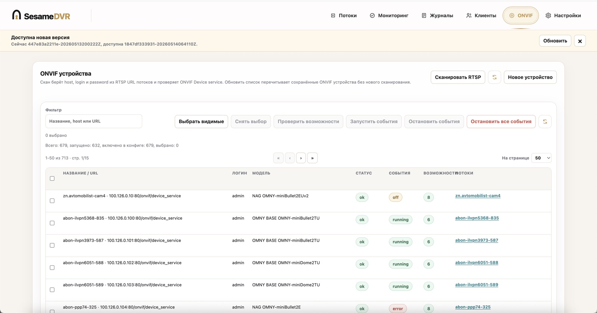
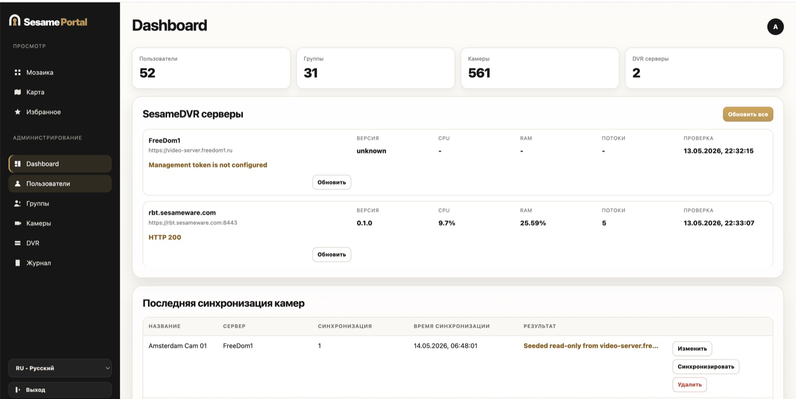
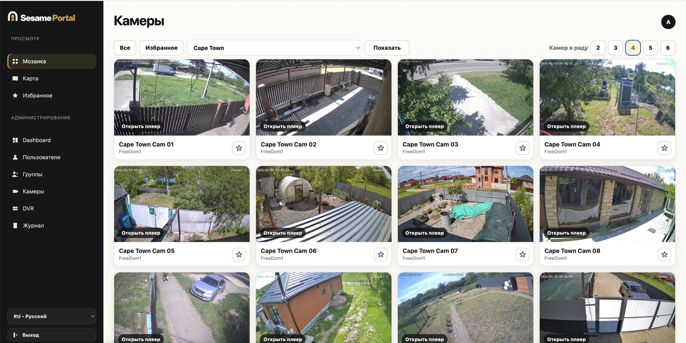
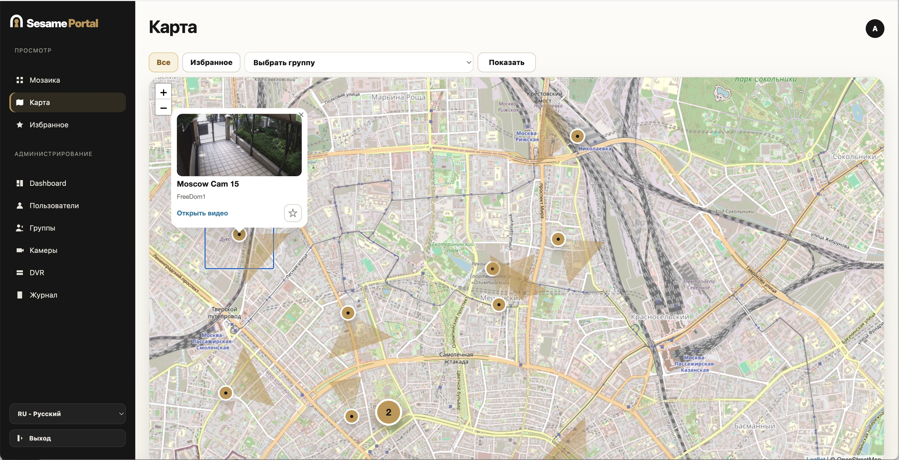
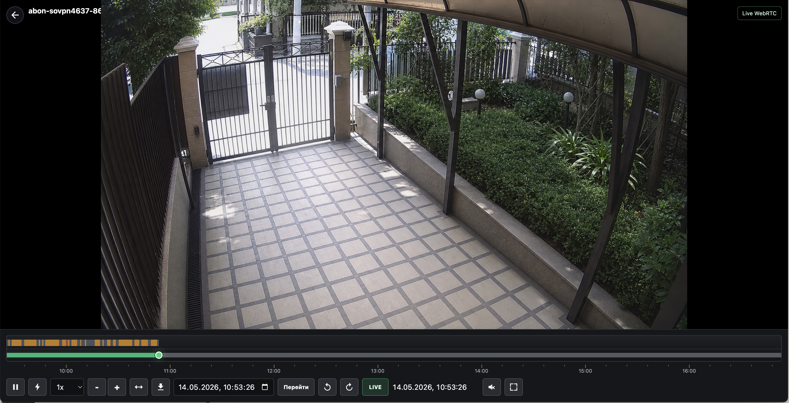
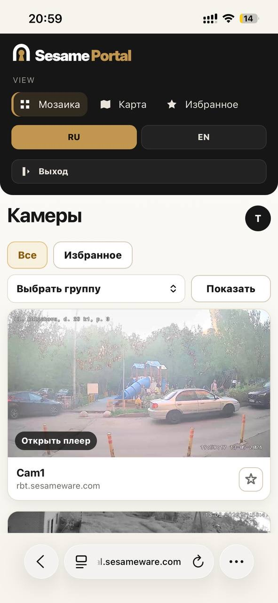
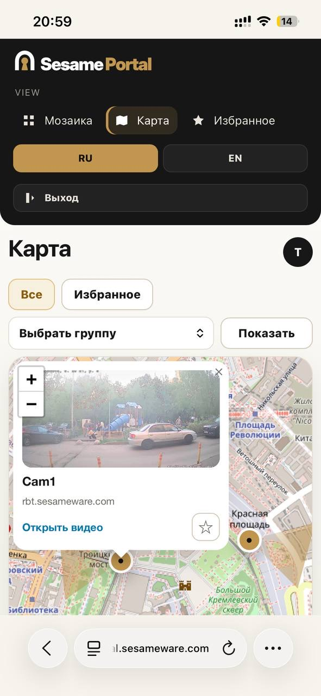
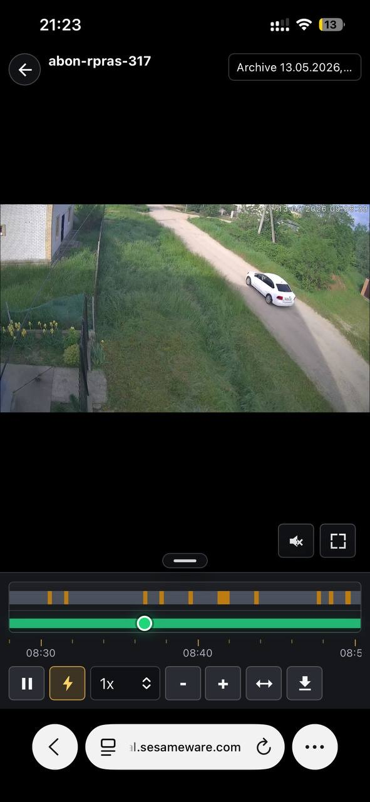

# SesamePortal

Языки: [English](README.md) | [Русский](README.ru.md)

SesamePortal - локальный PHP-портал видеонаблюдения для инсталляций
SesameDVR. Он управляет DVR-серверами, пользователями, группами, камерами,
персональными playback-токенами, избранным и предоставляет режимы просмотра
камер в мозаике и на карте через auth-backend для SesameDVR.

## Локальная разработка

```bash
php bin/portal migrate
php bin/portal create-admin admin admin123
php -S 127.0.0.1:8080 -t public
```

Откройте `http://127.0.0.1:8080`.

Локальное состояние по умолчанию хранится в `var/portal.sqlite`. Production
установка использует `/var/lib/sesame-portal`.

SQLite используется как backend хранения по умолчанию. PostgreSQL/MySQL можно
выбрать через config или переменные окружения:

```php
'db_dsn' => 'pgsql:host=127.0.0.1;port=5432;dbname=sesame_portal',
'db_user' => 'sesame_portal',
'db_password' => 'secret',
```

Те же значения можно передать через `SESAME_PORTAL_DB_DSN`,
`SESAME_PORTAL_DB_USER` и `SESAME_PORTAL_DB_PASSWORD`.

Интерфейс поддерживает тот же набор языков, что и SesameDVR: `ru`, `en`, `de`,
`fr`, `es`, `it`, `pt`, `bg`, `pl`, `zh`, `ja`, `ko`, `ar` и `hy`. Язык по
умолчанию задаётся через `locale` или `SESAME_PORTAL_LOCALE`; пользователь может
сменить язык в выпадающем списке интерфейса или через `?lang=<code>`.

## Режимы камер

Каждая камера может работать в одном из двух режимов:

- `managed`: SesamePortal записывает конфигурацию потока на выбранный
  SesameDVR-сервер через management API.
- `read_only`: SesamePortal не меняет конфигурацию DVR и использует выбранный
  DVR-сервер вместе с `dvr_stream_name` только для preview, auth и playback.

## Интерфейс просмотра

Мозаика поддерживает фильтрацию по всем камерам, избранному и группам, поиск по
названию камеры, пагинацию и переключатель плотности от 2 до 6 камер в ряду.
Карточки камер имеют фиксированное соотношение сторон 16:9. Preview
предзагружаются за loader и подменяются только после полной загрузки, поэтому
при обновлении не видно промежуточной перерисовки изображения. Частота
обновления preview выбирается в интерфейсе просмотра, включая режим
`Отключено`. Если поток на DVR сейчас недоступен, карточка показывает статус
`Поток недоступен`; при этом старое preview может оставаться видимым с этим
статусом поверх изображения.

Карта поддерживает те же фильтры и поиск по названию камеры. Она автоматически
подбирает масштаб под текущий набор камер, объединяет близкие камеры в кластеры
на малом масштабе, показывает направление и сектор обзора камеры, а также даёт
ту же кнопку добавления в избранное, что и мозаика.

Все даты и время в интерфейсе отображаются в часовом поясе браузера.
Сервер хранит и передаёт время как абсолютные значения.

## Скриншоты

### SesameDVR

| Потоки и player | Мониторинг | ONVIF |
| --- | --- | --- |
|  |  |  |

### SesamePortal: desktop

| Dashboard | Мозаика | Карта | Player |
| --- | --- | --- | --- |
|  |  |  |  |

### SesamePortal: mobile

| Мозаика | Карта | Player |
| --- | --- | --- |
|  |  |  |

## Production-установка

```bash
sudo bash scripts/install.sh \
  --domain portal.example.com \
  --email admin@example.com \
  --admin-login admin \
  --admin-password 'change-me-now'
```

Инсталлятор создаёт nginx site, подключает обнаруженный php-fpm socket,
инициализирует SQLite, создаёт первого администратора и может выпустить
сертификат Let's Encrypt через `certbot certonly --webroot`. Он записывает
только site-файл SesamePortal и не позволяет certbot переписывать существующие
nginx site-конфиги.

Для repair/update запуска поверх существующей базы:

```bash
sudo bash scripts/install.sh \
  --domain portal.example.com \
  --email admin@example.com \
  --repair
```

Инсталлятор делает backup текущего release, nginx site, cron entry, config и
SQLite-файлов перед применением изменений. Если шаг установки завершается
ошибкой, он восстанавливает эти файлы и по возможности reload'ит nginx.

## Первый вход

После установки откройте URL портала:

```text
https://portal.example.com
```

Используйте логин и пароль, которые были переданы в install script:

- логин: значение `--admin-login`, по умолчанию `admin`;
- пароль: значение `--admin-password`.

Для примера из команды выше:

```text
login: admin
password: change-me-now
```

При запуске с `--repair` инсталлятор не меняет существующих администраторов,
если `--admin-password` не был передан.

## Установка SesameDVR Trial

SesamePortal обычно подключается к одному или нескольким серверам SesameDVR.
Для GitHub evaluation-инсталляций используйте этот публичный trial-ключ
SesameDVR:

```bash
curl -fsSL https://license.sesameware.com/sesame-dvr-artifacts/bootstrap-trial-install.sh | sudo bash -s -- --license-key SDVR-TRIAL-85GT2-A7YYD-HSSEN-YW98U
```

Для публичного HTTPS-доступа передайте домен DVR и ACME email:

```bash
curl -fsSL https://license.sesameware.com/sesame-dvr-artifacts/bootstrap-trial-install.sh \
  | sudo bash -s -- \
      --license-key SDVR-TRIAL-85GT2-A7YYD-HSSEN-YW98U \
      --publish-service \
      --publish-server-name dvr.example.com \
      --publish-acme \
      --acme-email admin@example.com
```

Подробнее:
[`docs/SESAME-DVR-TRIAL-INSTALL.ru.md`](docs/SESAME-DVR-TRIAL-INSTALL.ru.md).

Дополнительная документация SesameDVR:

- [Описание возможностей и продукта SesameDVR](docs/SESAME-DVR-PRODUCT-DESCRIPTION.ru.md)
- [Руководство пользователя SesameDVR](docs/sesame-dvr-user-guide.ru.md)

## CLI

```bash
php bin/portal migrate
php bin/portal create-admin <login> <password>
php bin/portal rotate-tokens
php bin/portal rotate-secrets
php bin/portal backup /path/to/backup.json
php bin/portal restore /path/to/backup.json
```

`rotate-secrets` заново шифрует сохранённые SesameDVR management tokens с
использованием текущего `crypto_primary_key`, сохраняя доступ к старым key id
на период ротации.

## Проверки

```bash
php -l app/Portal.php
bash -n scripts/install.sh
tests/http_smoke.sh
```
