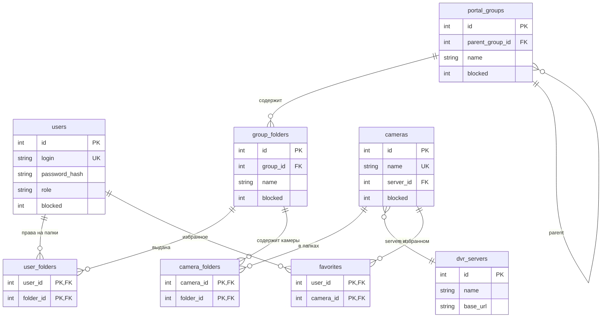
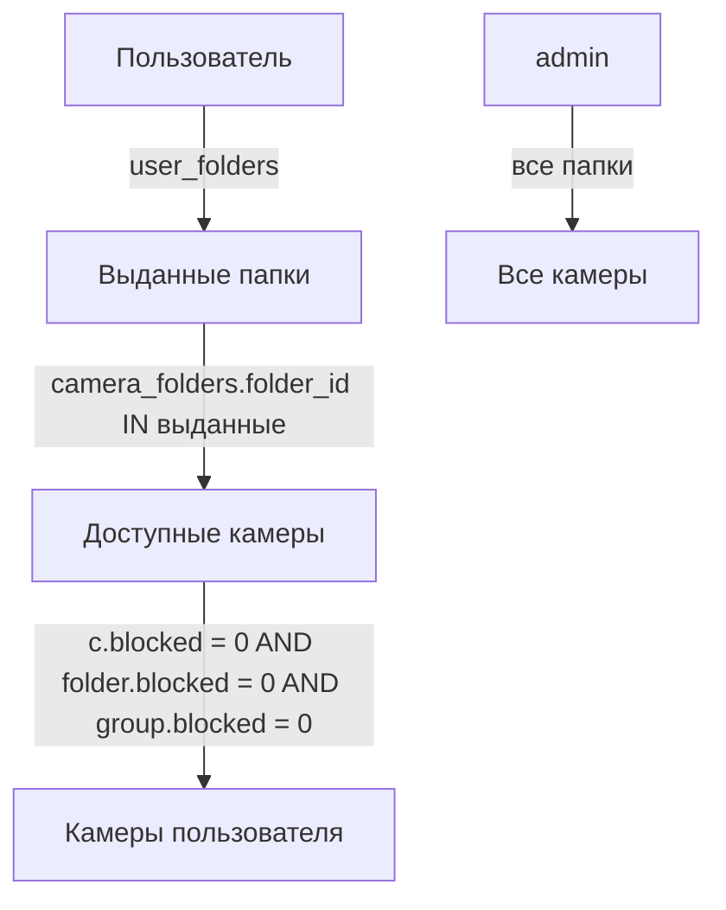

# Схема данных: группы, папки, пользователи, камеры

Хранилище — SQLite (`var/portal.sqlite`, путь из конфига `db_path`), либо PostgreSQL/MySQL
при задании `db_dsn`. Схема создаётся автоматически при старте из `schemaStatements()`
и миграций в `app/DB.php`.

## Модель доступа через папки

Доступ пользователей к камерам организован **папками внутри групп**. Группа остаётся
деревом для организации (город → район), но права и привязка камер идут на уровне папок.

- Администратор создаёт группу и внутри неё — **папки** (с произвольными названиями).
- Камеры привязываются к **папкам** (M:N `camera_folders`).
- Пользователю выдаются права на конкретные **папки** (M:N `user_folders`).
- Пользователь сразу видит все камеры из всех своих папок — без выбора папки в viewer.
- Наследования по дереву групп **нет**: пользователь видит только явно выданные папки.
- Папки и их привязки — административная концепция; обычный пользователь не выбирает
  папку, а просто видит все доступные ему камеры.

## Таблицы и связи

| Таблица | Ключевые поля | Связь |
|---|---|---|
| `users` | `id` PK, `login` UNIQUE, `password_hash`, `role` (`admin`/`user`), `blocked`, `daily_token`, `static_token_hash`, `created_at`, `last_login_at` | родитель для `user_folders`, `favorites` |
| `portal_groups` | `id` PK, `parent_group_id` → `portal_groups.id` (`ON DELETE SET NULL`), `name`, `description`, `blocked` | дерево групп; контейнер для `group_folders` |
| `group_folders` | `id` PK, `group_id` → `portal_groups.id` (`CASCADE`), `name`, `description`, `blocked`, `created_at` | папка внутри группы; родитель для `camera_folders`, `user_folders` |
| `cameras` | `id` PK, `name` UNIQUE, `server_id` → `dvr_servers.id` (`SET NULL`), `latitude`, `longitude`, `direction_deg`, `view_angle_deg`, `blocked`, `dvr_stream_name` | родитель для `camera_folders`, `favorites` |
| `camera_folders` | `(camera_id, folder_id)` PK → `cameras.id`, `group_folders.id` (`CASCADE`) | **M:N камеры ↔ папки** |
| `user_folders` | `(user_id, folder_id)` PK → `users.id`, `group_folders.id` (`CASCADE`) | **M:N пользователи ↔ папки (права)** |
| `dvr_servers` | `id` PK, `name`, `base_url`, `management_token_enc` | 1:N: камера ссылается на сервер |
| `favorites` | `(user_id, camera_id)` PK → `users.id`, `cameras.id` (`CASCADE`) | избранное пользователя |
| `audit_logs` | `actor_user_id`, `action`, `details` | журнал (внешний ключ не задан) |

> Legacy таблицы `user_groups` и `camera_groups` удалены. При первом запуске новой версии
> данные автоматически мигрируются: для каждой группы, где были камеры, создаётся папка
> (имя = имя группы), связи переносятся в `camera_folders`; каждому пользователю выдаются
> права на все папки всех групп его ветки, чтобы сохранить прежний доступ. После миграции
> старые таблицы удаляются, а администратор может переименовать папки по своему усмотрению.

## ER-диаграмма

## Схема зависимостей доступа

- **admin** — видит и создаёт папки; видит все незаблокированные камеры.
- **user** — доступные папки = из `user_folders` (с отсечением заблокированных папок и
  папок заблокированных групп). Камера доступна, если она в хотя бы одной доступной
  папке и не заблокирована (`c.blocked = 0`). Наследования подгрупп нет.
- В viewer групповой/папочный фильтр отсутствует — пользователь сразу видит все
  доступные камеры. Фильтр по папке (`folder:ID`) и legacy-фильтр по группе (`group:ID`,
  разворачивается в папки ветки группы) доступны в админ-списке камер и через API.

## Ключевые точки кода

- `app/DB.php`
  - `schemaStatements()` / `sqliteSchema()` / `pgsqlSchema()` / `mysqlSchema()` — таблицы,
    включая `group_folders`, `camera_folders`, `user_folders`.
  - `migrateGroupsToFolders()` — миграция legacy `user_groups`/`camera_groups` → папки.
- `app/Repo.php`
  - `userAccessibleFolderIds()` — доступные папки пользователя (admin → все; user → из
    `user_folders` с отсечением заблокированных).
  - `accessibleCameraScope()` — SQL-scope доступа к камерам (JOIN `camera_folders`).
  - `foldersForUser()` / `allFolders()` / `foldersForGroup()` / `folder()` — выборки папок.
  - `folderIdsForGroups()` — идентификаторы папок для набора групп.
- `app/Traits/AppDataTrait.php` — `folderRowsWithGroupLabels()`, `folderTreeStructure()`.
- `app/Traits/AppRenderTrait.php` — `folderCheckboxTree()`, фильтры админ-списков
  камер/пользователей по `folder_id`, viewer `filters()` (без группового дерева).
- `app/Traits/AppPagesTrait.php` — `groups()` (управление папками группы), формы
  пользователя/камеры/импорта с деревом папок.
- `app/Traits/AppApiTrait.php` — CRUD `/api/portal/v1/folders`, `/folders/:id/users|cameras`,
  `folderIds` в users/groups/cameras.

## Каскады удаления

- Удаление **пользователя** → чистятся `user_folders`, `favorites`.
- Удаление **группы** → чистятся `group_folders` (и каскадно `camera_folders`,
  `user_folders`); у дочерних групп `parent_group_id` обнуляется (`SET NULL`).
- Удаление **папки** → чистятся `camera_folders`, `user_folders`.
- Удаление **камеры** → чистятся `camera_folders`, `favorites`.
- Удаление **DVR-сервера** → у камер `server_id` обнуляется (`SET NULL`).