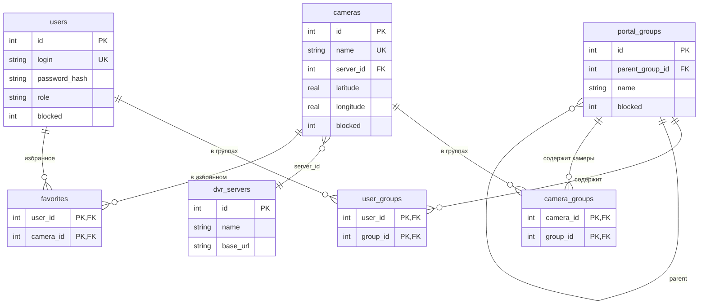
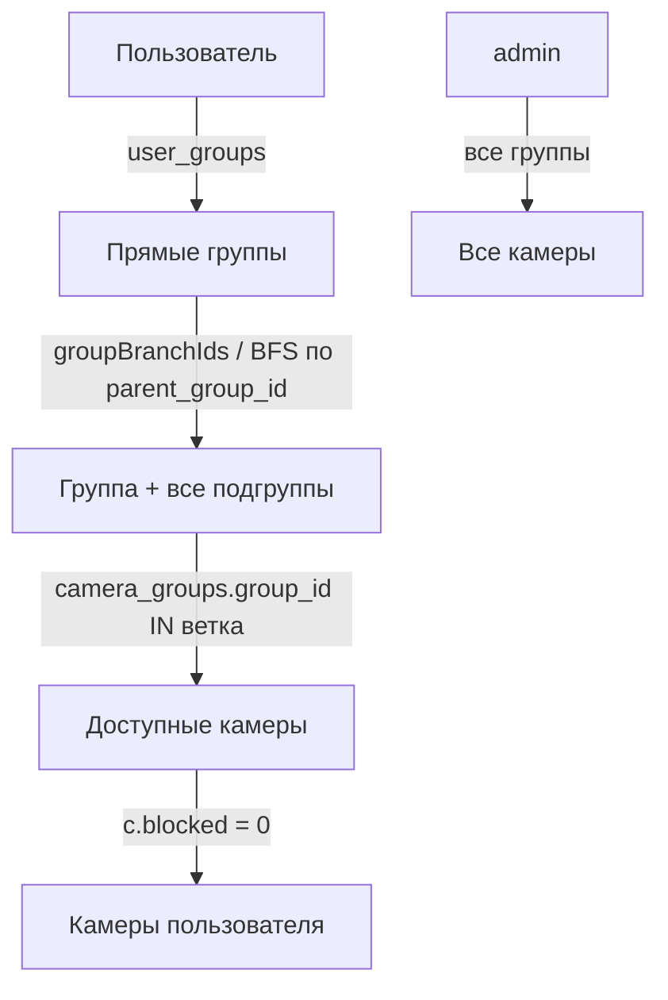

# Схема данных: группы, пользователи, камеры

Хранилище — SQLite (`var/portal.sqlite`, путь из конфига `db_path`), либо PostgreSQL/MySQL
при задании `db_dsn`. Схема создаётся автоматически при старте из `schemaStatements()`
в `app/Portal.php` (строки ~232–546).

## Таблицы и связи

| Таблица | Ключевые поля | Связь |
|---|---|---|
| `users` | `id` PK, `login` UNIQUE, `password_hash`, `role` (`admin`/`user`), `blocked`, `daily_token`, `static_token_hash`, `created_at`, `last_login_at` | родитель для `user_groups`, `favorites` |
| `portal_groups` | `id` PK, `parent_group_id` → `portal_groups.id` (`ON DELETE SET NULL`), `name`, `description`, `blocked` | дерево групп; родитель для `user_groups`, `camera_groups` |
| `user_groups` | `(user_id, group_id)` PK → `users.id`, `portal_groups.id` (`CASCADE`) | **M:N пользователи ↔ группы** |
| `cameras` | `id` PK, `name` UNIQUE, `server_id` → `dvr_servers.id` (`SET NULL`), `latitude`, `longitude`, `direction_deg`, `view_angle_deg`, `blocked`, `dvr_stream_name` | родитель для `camera_groups`, `favorites` |
| `camera_groups` | `(camera_id, group_id)` PK → `cameras.id`, `portal_groups.id` (`CASCADE`) | **M:N камеры ↔ группы** |
| `dvr_servers` | `id` PK, `name`, `base_url`, `management_token_enc` | 1:N: камера ссылается на сервер |
| `favorites` | `(user_id, camera_id)` PK → `users.id`, `cameras.id` (`CASCADE`) | избранное пользователя |
| `audit_logs` | `actor_user_id`, `action`, `details` | журнал (внешний ключ не задан) |

## ER-диаграмма

## Схема зависимостей доступа

- **admin** — видит все группы и все незаблокированные камеры.
- **user** — доступные группы = прямые группы из `user_groups` + всё их поддерево
  (`parent_group_id`), заблокированные группы отсекаются.
- Камера доступна пользователю, если она принадлежит хотя бы одной группе из его ветки
  и не заблокирована (`c.blocked = 0`).
- Фильтр `group:ID` дополнительно проверяет пересечение выбранной ветки с доступной
  пользователю (не-админ не может открыть чужую группу).

## Ключевые точки кода (`app/Portal.php`)

- `schemaStatements()` / `sqliteSchema()` / `pgsqlSchema()` / `mysqlSchema()` — схема БД (~232).
- `userAccessibleGroupIds()` (~3981) — доступные группы: admin → все; user → ветка от прямых групп.
- `groupBranchIds()` (~3924) — иерархическое разворачивание поддерева групп.
- `directUserGroupIds()` (~3974) — группы из `user_groups`.
- `accessibleCameraScope()` (~4060) — SQL-scope доступа к камерам (JOIN `camera_groups`).
- `groupsForUser()` (~4124) — группы, отображаемые пользователю в UI.

## Каскады удаления

- Удаление **пользователя** → чистятся `user_groups`, `favorites`.
- Удаление **группы** → чистятся `user_groups`, `camera_groups`; у дочерних групп
  `parent_group_id` обнуляется (`SET NULL`).
- Удаление **камеры** → чистятся `camera_groups`, `favorites`.
- Удаление **DVR-сервера** → у камер `server_id` обнуляется (`SET NULL`).
